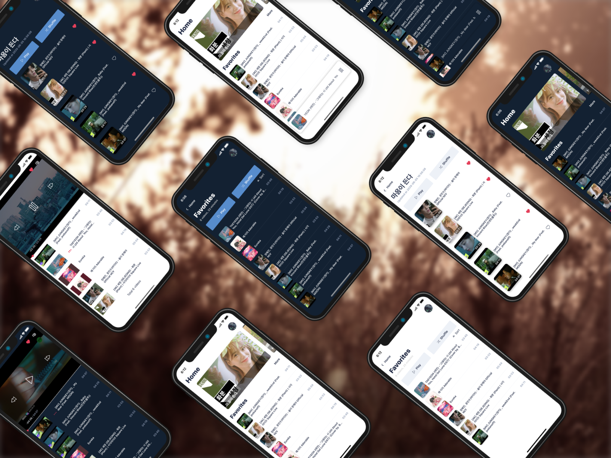

#  KTube

Youtube Background Music App



# Usage

git clone this repo

go to `Google Colud Platform` to create your project with `YouTube Data API v3`

then create OAuth 2.0 credential with type `iOS`

create `.env` file under project folder, then put your client id like below

```
  IOS_CLIENT_ID=your client id
```

then feel free to test it !

# Functionality

- Youtube Backgorund Music
- Dark Mode
- import playlist from youtube by Youtube API and Playlist URL
- save your favorite video anytime

# Why

This is my personal side project for improve my React and React Native skill.

also I'm a music lover, so I made this app for myself to listen Youtube music video more convenient and also ad free !!

some code is pretty ugly I know, so feel free to give some advice to me :D
